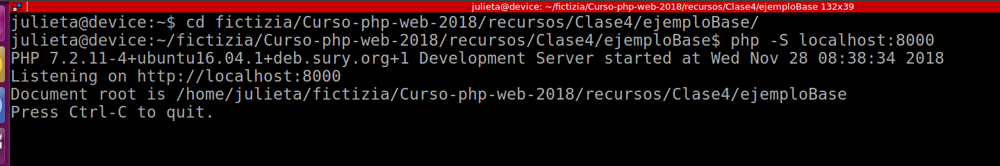
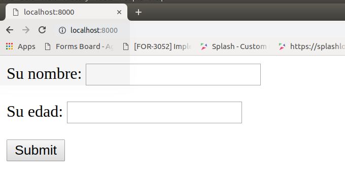

step by step: Arrancar el servidor web
===
0) 

1) ir al directorio donde están los ficheros que vamos a usar

    ``` 
        $ cd 
        $ cd Curso-php-web-2018/ejercicios/Clase4
        $ pwd (*esto es para comprobar que estás en ese directorio*)
        $ ls -lhart (*esto es para listar donde estás*)
        $ php -S localhost:8000
    ```
    Veremos esto:
            
    Observa que hay un mensaje que dice:
    ``` 
        Document root is /home/julieta/fictizia/Curso-php-web-2018/recursos/Clase4/ejemploBase
    ```
    Eso significa que serviremos los ficheros dentro del directorio clase4/ejemploBase

2) abrir el navegador
    Escribir 'localhost:8000' en la línea de direcciones
    Como hay un fichero index.html en la raíz del directorio Clase4/ejemploBase, ese será el fichero que nos muestre el servidor 
    

