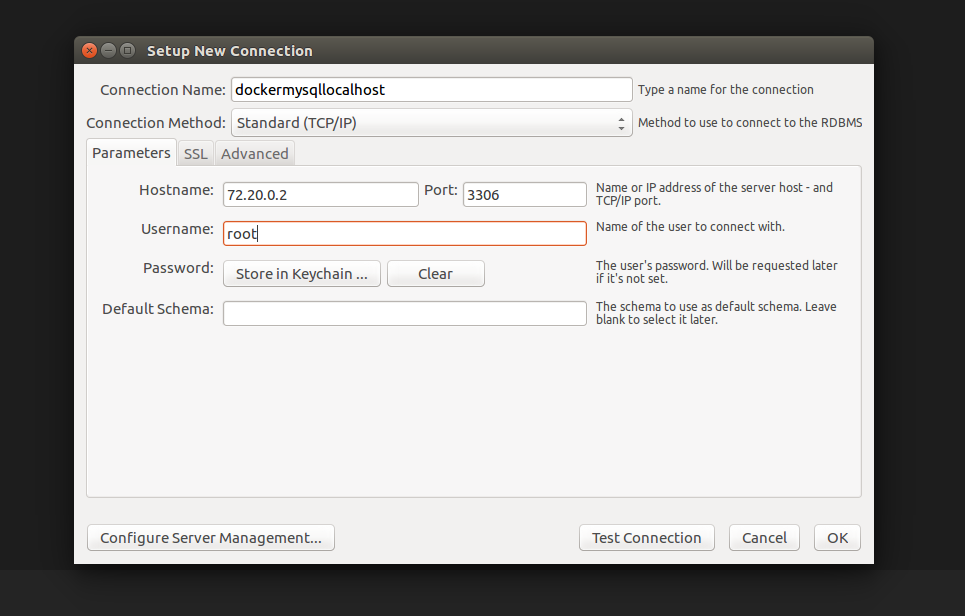
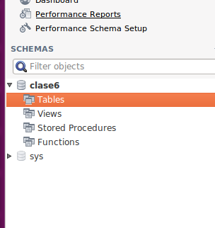
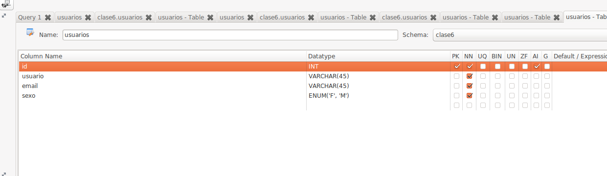
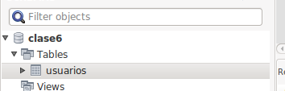

Hoy vamos a sacar los datos de ayer de una base de datos en vez de sacarlos de un fichero
pasos:
* Docker: instalacion
* Mysql Workbench: instalacion
* Levantar un docker con mysql
* conectar msyql workbench
* crear tabla
* insertar datos


Docker
===
Instalacion

MySql Workbench
===
$ brew cask install mysqlworkbench

levantar un docker con Mysql
===
$ cd recursos/Clase6/ejemplo
$ docker-compose up -d

conectarle mysql workbench
===

$ docker ps 
(quedarse con el nombre de la maquina)
$ docker inspect NAME | grep IP
(quedarse con la IPAdress)



Pulsar test connection
Meter el pass(esta en el fichero /recursos/Clase6/ejemplo/docker-compose.yml, en la linea 10)

crear tabla
===
boton derecho / crear tabla



nuestra estructura de datos era:

    [
        'usuario' => 'maria gonzalez', 
        'email' => 'mariag@fakemail.com',
        'sexo' => 'F',
        'tareas' => [
            'hacer ejercicio de java'
        ],
    ],

creamos todo menos las tareas


```
CREATE TABLE `clase6`.`usuarios` (
  `id` INT NOT NULL AUTO_INCREMENT,
  `usuario` VARCHAR(45) NOT NULL,
  `email` VARCHAR(45) NOT NULL,
  `sexo` ENUM('F', 'M') NOT NULL,
  PRIMARY KEY (`id`));
```

introducir datos
===


boton derecho, selecionar 'select rows'

rellenar todo menos id en cada fila, pulsar apply
```
INSERT INTO `clase6`.`usuarios` (`usuario`, `email`, `sexo`) VALUES ('mari', 'mari@fakemails', 'F');
INSERT INTO `clase6`.`usuarios` (`usuario`, `email`, `sexo`) VALUES ('rosa', 'rosa@fakemail.com', 'F');
INSERT INTO `clase6`.`usuarios` (`usuario`, `email`, `sexo`) VALUES ('luis', 'luis@fakemail.com', 'M');
INSERT INTO `clase6`.`usuarios` (`usuario`, `email`, `sexo`) VALUES ('mario', 'mario@fakemail.com', 'M');
INSERT INTO `clase6`.`usuarios` (`usuario`, `email`, `sexo`) VALUES ('paqui', 'paqui@fakemail.com', 'F');
INSERT INTO `clase6`.`usuarios` (`usuario`, `email`, `sexo`) VALUES ('antonio', 'antonio@fakemail.com', 'M');
```


DOCKER CON WORDPRESS (extra point)
===
https://docs.docker.com/compose/wordpress/
