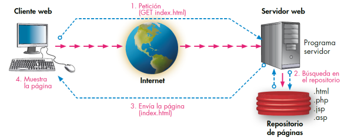

Formularios en php
====

El proceso: 

http://php.net/manual/es/tutorial.forms.php

Un ejemplo básico functionando:

Explicación:

Qué hace falta para que un form funcione:

1) servidor web
2) php en el servidor web
3) protocolo http
4) detalles del protocolo
5) php variables superglobales
6) tu codigo

## 1 - Servidores web

## 2 - php en un servidor web

    * apache
    * nginx
    * php light web server
        $ php -S localhost:8000 

## 3 - Protocolo HTTP
Es el protocolo de comunicación que se usa en la comunicación web.
Es stateless (sin estado, que quiere decir que no recuerdas lo que haces de una vez para otra).
Para asociar estado se usan cookies y sesiones.

https://es.wikipedia.org/wiki/Protocolo_de_transferencia_de_hipertexto#Ejemplo_de_di%C3%A1logo_HTTP

## 4 - Detalles del protocolo
cabeceras: https://es.wikipedia.org/wiki/Anexo:Cabeceras_HTTP

verbos: https://es.wikipedia.org/wiki/Protocolo_de_transferencia_de_hipertexto#M%C3%A9todos_de_petici%C3%B3n

best practices:
https://blog.restcase.com/5-basic-rest-api-design-guidelines

## 5 - Variables superglobales
http://php.net/manual/es/language.variables.superglobals.php

Estructuras de control
===

## bucle for:

    http://php.net/manual/en/control-structures.for.php

## bucle foreach:
    http://php.net/manual/en/control-structures.foreach.php

## condicional if:
    http://php.net/manual/en/control-structures.if.php

Trabajo con cadenas
===
## lista
    http://php.net/manual/es/ref.strings.php

## strpos
    http://php.net/manual/es/function.strpos.php

    

